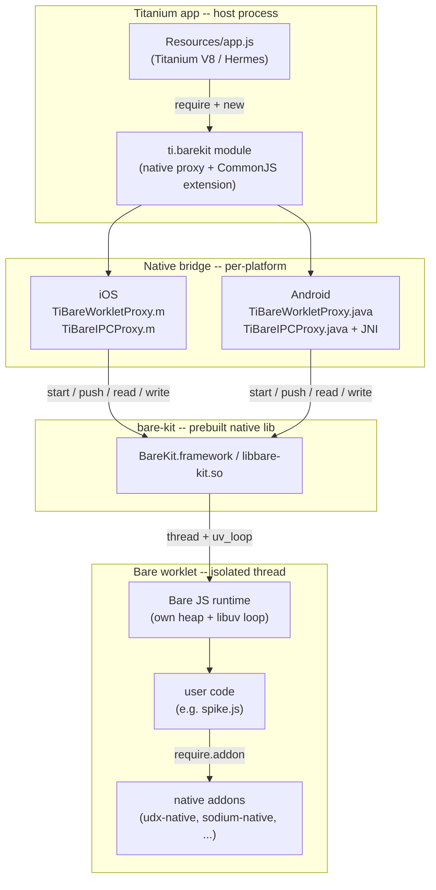
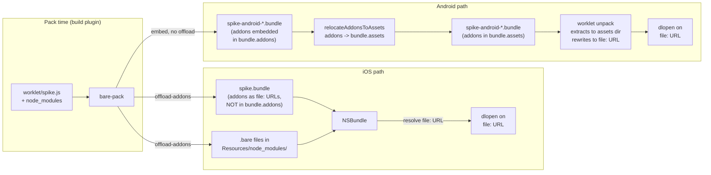
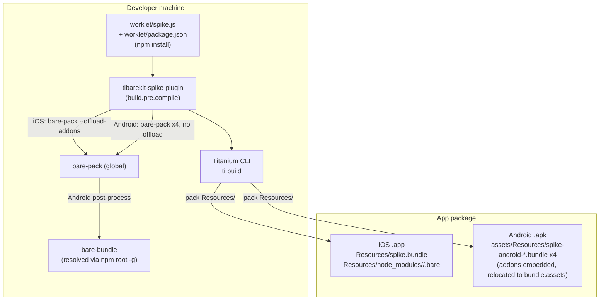
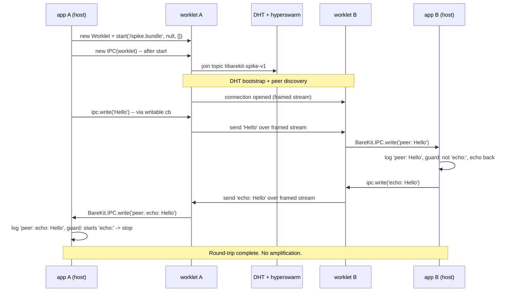
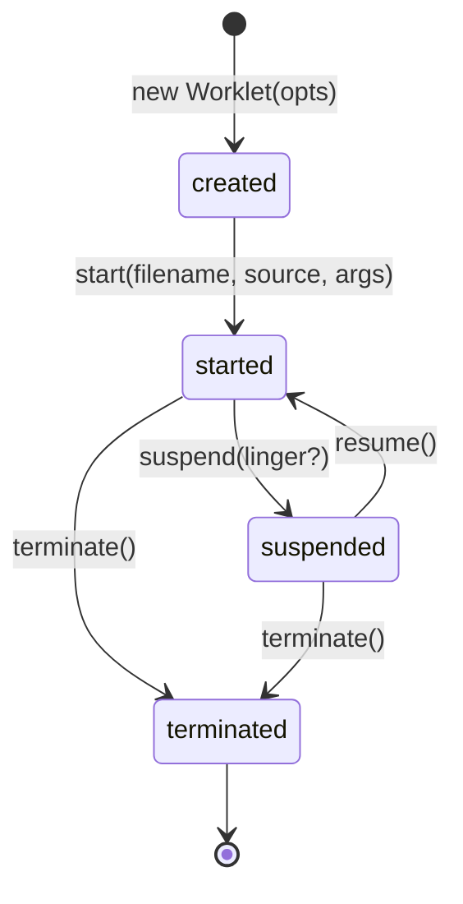

# TiBareKit Architecture

A comprehensive overview of the TiBareKit module: the technology it
wraps, how the pieces fit together at build time and run time, the
native addon resolution strategy (the non-obvious part), and the
hyperswarm spike dataflow that proves the stack end to end.

For the API reference, see [`documentation/index.md`](index.md). For
the spike's build + run instructions, see
[`DemoApp/BareKitDemo/README.md`](../DemoApp/BareKitDemo/README.md).

## What TiBareKit is

TiBareKit is a Titanium SDK module that wraps the
[holepunchto/bare-kit](https://github.com/holepunchto/bare-kit) runtime
and exposes it to Titanium applications on iOS and Android. Bare is a
small, fast JavaScript runtime from Holepunch. A Titanium app uses
TiBareKit to run JavaScript in an isolated Bare worklet process (on a
dedicated thread, with its own heap and libuv loop) and exchanges bytes
with it over an in-process IPC channel.

The module ships two JavaScript classes from `require('ti.barekit')`:

- **`Worklet`** -- owns a Bare runtime process. Give it inline source
  or a pre-bundled `.bundle` file, then call `start()`. Control its
  lifecycle with `suspend()` / `resume()` / `terminate()`.
- **`IPC`** -- a bidirectional byte channel between the Titanium host
  and a running `Worklet`, with synchronous polling (`read()` /
  `write()`) and asynchronous callbacks (`readable` / `writable`).

The native runtime binaries (the BareKit framework on iOS, the
`libbare-kit.so` slices + `bare-kit.jar` on Android) are prebuilt and
checked into the repo. App developers do not need CMake, the NDK, or a
Bare toolchain on their machine.

## Two-layer model

The Titanium host and the Bare worklet are two separate JavaScript
worlds. They share no heap and no event loop; they talk only through
byte streams (IPC) and a request/reply channel (push).

The split exists so the host can run UI work on the platform main
thread while the worklet runs CPU-heavy or network-heavy work off the
main thread. All native-to-JS callbacks (IPC readable/writable, push
reply) are dispatched back onto the platform main thread so the JS
side never has to think about thread affinity.

## Components

### `Worklet`

Owns a Bare runtime process. Construction takes an options dict
(`memoryLimit`, `assets`). `start(filename, source?, arguments?)`
launches the runtime: `filename` is the module URL the Bare runtime
uses for resolution (conventionally `/app.js` for inline source or
`/app.bundle` for bundle mode), `source` is the inline JS string or
`null` to load the bundle named by `filename`.

Lifecycle: `suspend(linger?)` pauses the worklet (the optional linger
is ms the worklet may keep running before suspending), `resume()`
un-pauses it, `terminate()` tears down the runtime. `push(payload, cb)`
sends a one-shot request/reply message outside the IPC byte stream.

### `IPC`

A bidirectional byte channel between the host and a `Worklet`, created
from a started worklet. The readable/writable callbacks are the
notification mechanism; `read()` and `write()` are the data movers.

**Contract:** the IPC channel MUST be created AFTER `worklet.start()`
returns. `new IPC(worklet)` dups the worklet's file descriptors
immediately, and those descriptors are invalid until the worklet has
started. Creating the IPC before `start()` yields a channel whose
callbacks never fire.

**One-shot `writable`:** the native writable source is level-triggered
(it fires continuously while the outgoing fd has buffer space, which
is always when idle). The native proxy deregisters the callback on
first fire, so `ipc.writable` delivers exactly one "ready to write"
notification. A consumer that needs another signal reassigns
`ipc.writable`. This mirrors the upstream iOS fix (commit `09726b0`).

**Write-before-writable:** never call `ipc.write(...)` before the
`writable` callback has fired. Doing so can write into a not-yet-armed
fd and crash the worklet.

### Native bridge

The JS classes in `assets/ti.barekit.js` (CommonJS extension) delegate
to per-platform native proxies:

- **iOS** -- `TiBareWorkletProxy.m` / `TiBareIPCProxy.m` (Obj-C,
  wrapping `BareKit.framework`). The CommonJS extension exports the JS
  `Worklet`/`IPC` wrapper classes; `require('ti.barekit')` returns the
  merged `{Worklet, IPC}`.
- **Android** -- `TiBareWorkletProxy.java` / `TiBareIPCProxy.java`
  (Java + JNI, wrapping `to.holepunch.bare.kit.Worklet` /
  `IPC` from `bare-kit.jar`). The Kroll proxy generator
  (`@Kroll.proxy`) auto-creates `createWorklet` / `createIPC`
  factories and getter-only `Worklet`/`IPC` properties on the module.
  The CommonJS extension SKIPS its `{Worklet, IPC}` export on Android
  (returns `{}`) so `require('ti.barekit')` returns the native proxies
  directly -- exporting the JS wrappers would collide with the native
  getter-only `Worklet`/`IPC` properties (`kroll.extend` does a plain
  assignment, which throws "Cannot set property Worklet ... has only a
  getter").

  The Android native proxies also override
  `TiBareIPCProxy.handleCreationArgs` so `new IPC(worklet)` (which the
  Kroll factory sees as `createIPC({worklet: <proxy>})`) wires the
  native IPC to the right worklet, and `setWritable` deregisters the
  native writable poll before delivering the JS callback (the one-shot
  fix).

### Build plugin (the spike)

`DemoApp/BareKitDemo/plugins/tibarekit-spike/1.0.0/plugin.js` is a
Titanium build plugin that runs at `build.pre.compile`. It invokes
`bare-pack` to turn the worklet source (`worklet/spike.js`) into a
`.bundle` file the worklet can load in bundle-loader mode, and it
handles the native addon prebuilds. See "Build pipeline" below.

## Bundle + native addon resolution (the non-obvious part)

A Bare `.bundle` is a serialized module graph produced by `bare-pack`.
It can embed JavaScript modules, assets, and native addon prebuilds
(`.bare` files -- shared libraries the Bare runtime `dlopen`s at
module-load time via `require.addon(...)`).

The subtlety: the stock bare worklet (`bare-kit shared/worklet.js`)
only extracts **`bundle.assets`** to the filesystem at runtime -- it
runs `unpack(bundle, { files: false, assets: true }, cb)`, which writes
each asset to a writable dir and rewrites its URL to a `file:` URL the
runtime can read. It does NOT extract **`bundle.addons`** (bare-unpack
defaults `addons = files = false` when `files:false` and `addons` is
not explicit). So a `.bare` registered as `bundle.addons` stays a
virtual bundle path, and `dlopen` on a virtual path fails.

iOS and Android resolve this differently because of where the bundle +
prebuilds live at app run time:

**iOS** uses `bare-pack --offload-addons`. The `.bare` files are
written as real files next to the bundle
(`Resources/node_modules/<pkg>/prebuilds/<host>/<addon>.bare`) and the
bundle's addon resolutions point at them as `file:`-ish URLs. iOS's
NSBundle exposes the app's `Resources/` as a filesystem-ish namespace
at runtime, so `dlopen` on those URLs resolves to real files. No
runtime extraction step is needed. The bundle's `bundle.addons` is
empty (offloaded addons are filtered out); the addon URLs live in the
bundle's per-module resolutions.

**Android** cannot use `--offload-addons` because the APK's
`assets/Resources/` are not on the filesystem -- `dlopen` on an
offloaded path fails. It also cannot rely on `bundle.addons` because
the stock worklet does not extract them. The build plugin works around
both:

1. Run `bare-pack` WITHOUT `--offload-addons` so the `.bare` bytes are
   embedded in the bundle (under keys like
   `/node_modules/<pkg>/prebuilds/<host>/<addon>.bare`), and the bundle
   has `bundle.addons = [those keys]`.
2. Post-process the bundle with `relocateAddonsToAssets`: load it via
   `bare-bundle`, move the addon keys from `bundle.addons` into
   `bundle.assets` (concat, not replace, so any pre-existing non-addon
   assets survive), re-serialize.

At run time, `app.js` passes a writable `assets` dir (a real filesystem
path resolved from `Ti.Filesystem.applicationDataDirectory` via
`Ti.File.nativePath`, since `applicationDataDirectory` is the scheme
`appdata-private://` on Android, not a real path). The worklet's
asset-unpack path extracts the `.bare` bytes to
`<assets>/<blake2b256(bundle.id)>/<key>` and rewrites each
`binding.js` `.` resolution to a `file:` URL pointing at the extracted
file. `Bare.Addon.load` then `dlopen`s the `file:` URL. You see SELinux
`avc: granted { execute }` audit lines for each extracted `.bare` --
that is the signal the workaround landed.

## Build pipeline

At `build.pre.compile`, the plugin runs `bare-pack` once on iOS (single
host `ios-arm64-simulator`) and four times on Android (one per ABI
host: `android-arm64`, `android-arm`, `android-ia32`,
`android-x64`). On Android, each bundle is then post-processed by
`relocateAddonsToAssets` (which lazily resolves `bare-bundle` from the
global `bare-pack` package via `createRequire`). The Titanium compile
step then packs `Resources/` into the `.app` / `.apk`.

`app.js` selects the Android bundle matching the runtime ABI
(`Ti.Platform.architecture` -> `spike-android-<host>.bundle`), falling
back to `android-arm64` on an unrecognized ABI.

## Runtime dataflow -- the hyperswarm spike

The `DemoApp/BareKitDemo` app proves the stack end to end. Two instances
(two iOS simulators, or an iOS simulator and an Android arm64 emulator)
join a fixed hyperswarm topic, discover each other through the DHT,
open a framed-stream connection, and round-trip a message. An echo
guard stops `echo: echo: ...` from amplifying forever.

The echo guard is the spike's anti-amplification rule: when a worklet
receives a `peer: <msg>` line, the host auto-echoes `echo: <msg>` back
-- but only if `<msg>` does NOT already start with `echo:`. Without
this guard, the two apps would ping-pong `echo: echo: echo: ...`
forever, growing the string each round and flooding IPC + the log
buffer.

### Worklet lifecycle

`terminate()` is terminal -- a worklet cannot be restarted; construct
a new `Worklet` if you need another one.

## IPC contracts

The IPC channel is the only data path between host and worklet (besides
`push`, which is request/reply, not a stream). The contracts that
matter:

1. **IPC after start.** `new IPC(worklet)` dups fds that are invalid
   until `worklet.start()` returns. Create the IPC AFTER start, or its
   callbacks never fire.

2. **One-shot writable.** `ipc.writable` fires exactly once. The native
   source is level-triggered; the proxy deregisters on first fire so
   you get one "ready to write" notification. Reassign `ipc.writable`
   if you need another.

3. **Write-before-writable crash.** Never call `ipc.write(...)` before
   `writable` has fired. Writing into a not-yet-armed fd can crash the
   worklet.

4. **Single-dict callback.** The native `push` callback and the
   `ipc.write(data, cb)` callback each deliver a single result dict:
   `{error}` on failure, `{reply}` (push) / `{}` (write success). The
   spike's `sendToWorklet` helper threads `{error}` into a visible log
   line so IPC errors never fail silently.

5. **Worklet `console.log` does NOT route to `Ti.API`.** Worklet
   `console.log` goes to the Bare/OS logger. The spike surfaces
   worklet messages in the `Ti.API` log by having the worklet call
   `BareKit.IPC.write(...)` and the host log it in the `readable`
   callback.

## Platform divergence

| Concern | iOS | Android |
|---|---|---|
| Native lib | `BareKit.framework` | `libbare-kit.so` (per-ABI) + `bare-kit.jar` |
| Proxy | Obj-C `TiBare*Proxy.m` | Java `TiBare*Proxy.java` + JNI |
| CommonJS export | `{Worklet, IPC}` (JS wrappers) | `{}` (native proxies only, export guard) |
| `new IPC(worklet)` wiring | JS wrapper -> native | native `handleCreationArgs` override |
| Bundle count | 1 (`spike.bundle`, `ios-arm64-simulator`) | 4 (`spike-android-<host>.bundle`, one per ABI) |
| Addon strategy | `--offload-addons` + NSBundle resolves `file:` URLs | embed + relocate `bundle.addons` -> `bundle.assets` + worklet extracts to `assets` dir |
| `assets` option | (iOS uses NSBundle, no extraction dir needed) | real filesystem path via `getFile(applicationDataDirectory, 'bare-assets').nativePath` |
| Runtime bundle path | `/spike.bundle` (NSBundle resolves) | `AssetManager.open("Resources/spike-android-<host>.bundle")` -- strip leading `/`, prepend `Resources/` |
| `minsdk` / SDK pin | `13.3.0` | `13.3.0` (emulator API 31+ -- bare-kit upstream `minSdk 31`) |

## The hyperswarm spike

`DemoApp/BareKitDemo/` is a spike, not a production app. Its job is to
prove the native runtime path works end to end: the holepunch native
addon stack (sodium-native for crypto, udx-native for UDP transport)
loads, hyperswarm joins a topic, two instances discover each other
through the DHT, and a message round-trips with the echo guard holding.

The spike is proven when all four hold:

1. Both apps launch without crashing (native addons loaded).
2. No `FATAL:` line in either log.
3. A `connection opened` fires on both sides within 15 s.
4. A message round-trips between the two instances (A -> B -> A) with
   the echo guard stopping `echo: echo: ...` amplification.

The full pear-chat port (autobase, blind-pairing, hyperdb, chat UI) is
a separate later cycle. See
[`DemoApp/BareKitDemo/README.md`](../DemoApp/BareKitDemo/README.md)
for the build + run instructions, prerequisites, failure-mode
diagnostics, and the worked example.

## Known limitations

- **No unit-test framework.** The Titanium native module + build plugin
  + JS app combination has no unit-test harness. Each code task's
  verify step is a build/compile check; the end-to-end spike is the
  final verification. This is a plan-mandated constraint, not a gap.
- **3 of 4 Android ABIs are runtime-untested.** The spike exercises only
  `android-arm64`. The `android-arm`, `android-ia32`, and
  `android-x64` bundles are built and relocated but never `dlopen`'d at
  runtime. A wrong host mapping for an untested ABI would not be caught
  by the spike.
- **`setWritable` re-entrancy race (fixed).** The native writable source
  fires on its own thread, deregisters, then posts the JS callback to
  the main looper / main queue. If `ipc.writable` was reassigned in the
  window between the deregister and the deferred dispatch, the posted
  block used to read the field at fire time and deliver the OLD event
  to the NEW callback -- a spurious fire that also consumed the new
  arming without a fresh notification. Both proxies now capture the
  callback in a local before the deferred dispatch (`cbToFire` in
  `TiBareIPCProxy.m:setWritable:` and `TiBareIPCProxy.java:setWritable`),
  so the old event always goes to the old callback and the new arming gets
  its own fresh fire. The spike assigns `ipc.writable` once and never
  reassigns, so the bug was inert there; the fix matters for production
  consumers that reassign.